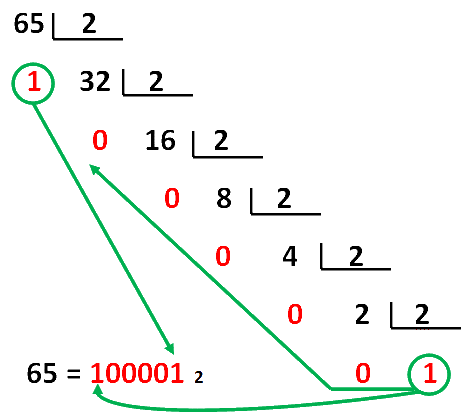

# La Informática

&nbsp;&nbsp;

La **informática** (término que procede de la combinación de las palabras **infor**mación y auto**mática**) es la ciencia que estudia el tratamiento automatizado de la información digital utilizando ordenadores.

## 1. ¿Cómo funciona un ordenador?

Un **ordenador** es una máquina electrónica capaz de procesar datos muy rápidamente, pero *¿cómo funciona un ordenador?*.

Los ordenadores siguen 3 pasos principales a la hora de tratar los datos:

1. Obtienen los datos a partir de algún **periférico de entrada** (*teclado, ratón, pantalla táctil,...*) o de otros ordenadores.
2. El **microprocesador** (*el cerebro del ordenador*) organiza, almacena y transforma los datos, es decir, los procesa.
3. Muestran la información en algún **periférico de salida** (*pantalla, impresora, ...*).

## 2. ¿Cómo se representa la información en un ordenador? 

El ordenador funciona con de corriente eléctrica, *¿cuántos estados diferentes se pueden representar con la corriente eléctrica?*

* Una bombilla sólo puede tener dos estados: encendida o apagada.
* Un cable eléctrico sólo puede estar en dos estados: con corriente o sin corriente.

Por tanto, sólo hay dos estados posibles que podemos representar. Numéricamente, en informática, estos estados se representan con el 0 y el 1. Estos dos dígitos se llaman **bits**, y el sistema que forman se llama **sistema binario**.

No podemos guardar o almacenar un bit suelto en un ordenador. Los bits se almacenan en grupos de 8; esta cantidad se llama **byte**. Por tanto, el tamaño mínimo que puede tener un archivo con información es de 1 byte (si no tiene información, tendrá 0 bytes)

## 2.1 Sistemas de numeración

Un sistema de numeración es un conjunto de símbolos y reglas que permiten representar datos numéricos. Un mismo símbolo puede tener distinto valor según la posición que ocupe.

La base de un sistema de numeración nos indica cuantas cifras pueden usarse en el sistema, veamos:

| Base | Sistema     | Cifras que emplea                  |
| ---- | ----------- | ---------------------------------- |
|  2   | binario     | 0; 1                               |
|  3   | ternario    | 0; 1; 2                            |
|  4   | cuaternario | 0; 1; 2; 3                         |
|  5   | quinario    | 0; 1; 2; 3; 4;                     |
|  6   | senario     | 0; 1; 2; 3; 4; 5;                  |
|  7   | heptal      | 0; 1; 2; 3; 4; 5; 6;               |
|  8   | octal       | 0; 1; 2; 3; 4; 5; 6; 7             |
|  9   | nonario     | 0; 1; 2; 3; 4; 5; 6; 7; 8          |
|  10  | decimal     | 0; 1; 2; 3; 4; 5; 6; 7; 8; 9       |
|  11  | undecimal   | 0; 1; 2; 3; 4; 5; 6; 7; 8; 9; A    |
|  12  | duodecimal  | 0; 1; 2; 3; 4; 5; 6; 7; 8; 9; A; B |

A = 10 B = 11

## 2.1.1 Conversión del sistema de numeración decimal al binario

El **sistema de numeración decimal o base 10** es el que empleamos en el día a día. En este sistema cualquier número se puede descomponer usando potencias de 10. 

Por ejemplo, 4532 se puede expresar de la siguiente forma:

 4532  = 4000 x 10^3^ + 500 x 10^2^ + 30 x 10^1^ + 2 x 10^0^  = 4000 + 500 + 30 + 2 

Para **convertir un número decimal a binario**, se divide sucesivamente entre 2 y, después, se toman el último cociente y todos los restos en orden inverso a como han aparecido.

    

## 2.1.2 Conversión del sistema de numeración binario al decimal

Para **convertir un número binario a decimal**, se multiplica cada cifra por la potencia de 2 que corresponde a su posición menos 1.

Por ejemplo, 110101 =  1 x 2^5^ + 1 x 2^4^ + 0 x 2^3^ + 1 x 2^2^ + 0 x 2^1^ + 1 x 2^0^  = 32 + 16 + 0 + 4 + 0 + 1 = 53

## 2.2 Unidades para medir la información

Normalmente los archivos ocupan varios bytes, incluso a veces miles o millones. De la misma forma que no decimos 800.000 metros sino que decimos 800 kilómetros, también existen medidas superiores al byte para representar cantidades elevadas de información. 

    <table width="50%">
        <tr>
            <th align="center">Medida</th>
            <th align="center">Equivalencia</th>
            <th align="center">Ejemplos</th>
        </tr>
        <tr>
            <td align="center">1 bit</td>
            <td align="center">1 ó 0</td>
            <td align="center">Sistema binario</td>
        </tr>
        <tr>
            <td align="center">1 byte</td>
            <td align="center">8 bits</td>
            <td align="center">Un carácter (letra, número o símbolo)</td>
        </tr>
        <tr>
            <td align="center">1 kilobyte (KB)</td>
            <td align="center">1000 bytes</td>
            <td align="center">Un documento, un libro</td>
        </tr>
        <tr>
            <td align="center">1 megabyte (MB)</td>
            <td align="center">1000 KB </td>
            <td align="center">Una foto, una canción</td>
        </tr>
        <tr>
            <td align="center">1 gigabyte (GB)</td>
            <td align="center">1000 MB</td>
            <td align="center">Vídeos, películas, capacidad de un disco duro</td>
        </tr>
        <tr>
            <td align="center">1 terabyte (TB)</td>
            <td align="center">1000 GB</td>
            <td align="center">Disco duro</td>
        </tr>
    </table>

## 2.2 Código ASCII

## 2.3 Sistema binario

## 3. El ordenador

## 3.1 Elementos funcionales del ordenador

## 4. Periféricos

## 4.1 Periféricos de entrada

## 4.2 Periféricos de salida

## 4.3 Periféricos de comunicación

## 4.4 Periféricos de almacenamiento

## 4.5 Conexión de los periféricos

## 5. Uso adecuado de las TIC

**Popularidad**

La popularidad la podemos medir en base a diferentes webs estadísticas. Por ejemplo, si comparamos las búsquedas en *Google Trends* de los principales frameworks PHP, podemos determinar cuáles son los más buscados a nivel mundial:

    

**Soporte y documentación**

Es importante analizar la documentación y la comunidad de desarrollo y soporte que hay detrás de cada framework. Por ejemplo, Laravel y Symfony, que son dos de los frameworks más difundidos, cuentan con una gran comunidad detrás (especialmente Laravel), y una documentación muy completa y actualizada.

* [Documentación de Laravel](https://laravel.com/docs)
* [Documentación de Symfony](https://symfony.com/doc/current/index.html)

